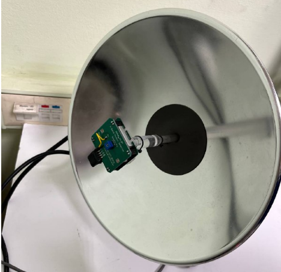
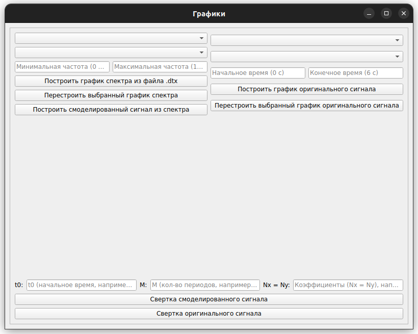
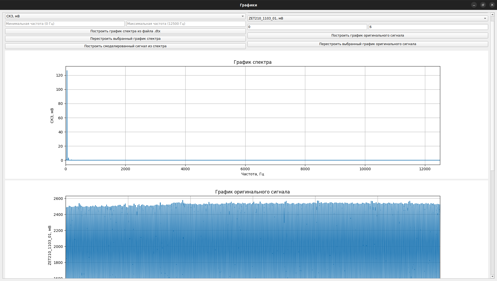
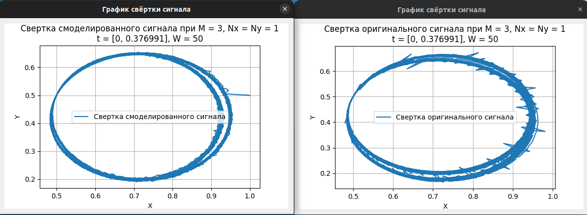

# GUI для анализа сверток доплеровского спектра с использованием ZETLAB

## Оборудование

Данный проект предназначен для анализа доплеровского спектра с использованием сверток сигнала. 

Оборудование:
* АЦП-ЦАП ZET-210
* Осциллограф Hantek 1008C
* Датчик детектора движения X-Band 
* Программное обеспечение ZETLAB

На картинке ниже показан датчик детектора движения X-Band


## Параметры ZETLAB
* Шаг дискретизации: 0.00004 сек
* Измеренный диапазон: 0-6 сек 
* Диапазон частот: 0-12500 Гц

## Инструкция запуска

Для запуска через Docker необходимо выполнить bash-скрипт по сборке контейнера:
```bash 
bash build_docker.sh
```

После сборки выполнить команду:
```bash
bash run_docker.sh
```

Если пользователь хочет запустить GUI без использования контейнера, то необходимо установить необходимые библиотеки в виртуальное окружение:
```bash
pip3 install -r requirements.txt
```

Далее необходимо выполнить python-скрипт:
```bash
python3 __main__.py
```

## Описание графического интерфейса

На рисунке ниже представлен графический интерфейс:


Для отрисовки графиков небходимо сохранить измеренные сигналы и спектры через ZETLAB в файл формата .dtx. Примеры записанных сигналов и сверток находятся в папке ```example```. После загрузки необходимых файлов графический интерфейс преобретает следующий вид:




В таблице ниже представлены описания виджетов для сигнала и спектра.

| Виджет                                           | Функция                 | 
|:------------------------------------------------:|--------------------------------------------------|
|Построить график спектра из файла .dtx            |Построить график спектра из указанного .dtx файла                  |
|Построить график оригинального сигнала            |Построить график оригинального сигнала из указанного .dtx файла    |
|Минимальная/Максимальная частота                  |Указать небоходимый диапазон частот                                   |
|Начальное/Конечное время                          |Указать необходимый временной интервал                                |
|СКЗ, Мв                                           |Выбрать ось ординат спектра (СКЗ, Среднее, Макс. и т.д)               |
|Частота, Гц                                       |Выбрать ось абсцисс спектра (СКЗ, Среднее, Макс. и т.д.)              |
|Время, с                                          |Выбрать ось абсцисс сигнала (Время, ZET210_1103_01, мВ)               |
|ZET210_1103_01, мВ                                |Выбрать ось ординат сигнала (Время, ZET210_1103_01, мВ)               |
|Перестроить выбранный график спектра              |Перестроить график спектра с указанными параметрами                  |
|Перестроить выбранный график оригинального сигнала|Перестроить график спектра с указанными параметрами                  |
|Построить смоделированный сигнал из спектра       |Построить смоделированный сигнал из спетра по формуле из [1]|

В таблице ниже представлены описания виджетов для сверток сигнала. Формулы и более подробное описание можно найти в [1].

| Виджет                | Функция                 | 
|:---------------------:|-------------------------|
|Свертка смоделированного сигнала|Построить свертку смоделированного сигнала|
|Свертка оригинального сигнала   |Построить свертку оригинального сигнала|
|t0                              |Начальный интервал времени для построения свертки|
|M                               |Число периодов принимаемых во внимание при построении свертки|
|Nx, Ny                          |Расстягивающие коэффициенты|

Примеры сверток показаны на рисунке ниже.



## Дальнейшие планы

В будущем планируется добавить отрисовки спектров для нескольких частот, а также написать нейронную сеть для идентификации объектов с помощью сверток.

## Список литературы

1. CПОСОБ СВЕРТКИ ИЗОБРАЖЕНИЙ ДЛЯ ПОСЛЕДУЮЩЕЙ ИДЕНТИФИКАЦИИ ОБЪЕКТОВ СЕРВИСНЫМИ РОБОТАМИ. Пряничников В. Е., Ястребов В.В.

